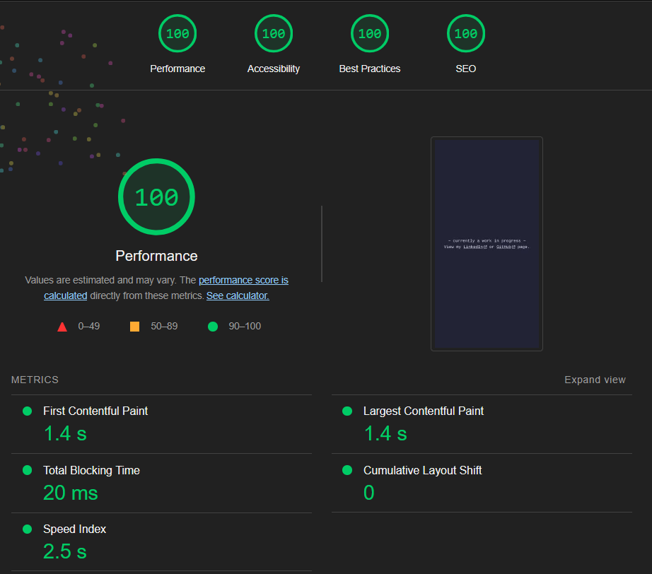

# adrians-sky.io
A personal website built with TypeScript and Next.js.

# Lighthouse Summary (Performance Report)
> This report was generated using the Mozilla Firefox's 
[Google Lighthouse](https://addons.mozilla.org/en-US/firefox/addon/google-lighthouse/) 
extension. 

# License
This project is licensed under the terms of the MIT License.

# Credits
Font Awesome by Dave Gandy - [http://fontawesome.io](https://fontawesome.io)

Google Lighthouse by Google Chrome - [https://developer.chrome.com/docs/lighthouse/](https://developer.chrome.com/docs/lighthouse/)
